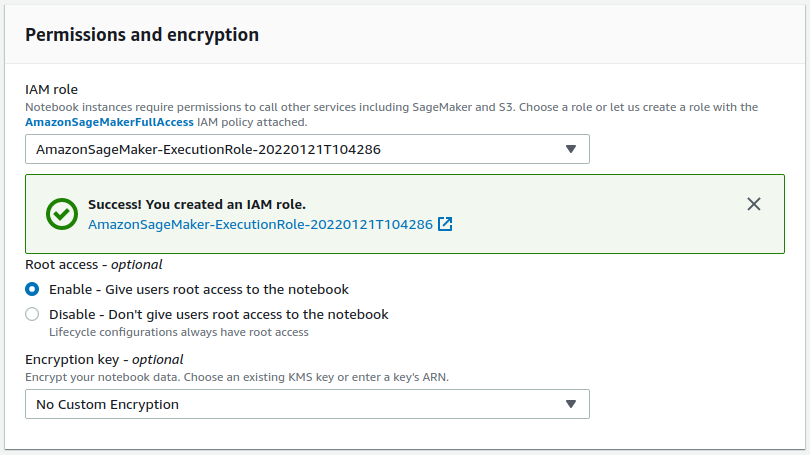

# EMLO Session 9

The objective of this class is to train a Resnet34 model on CIFAR100 using Pytorch Lightning on AWS Sagemaker

# Links

## Part 1

https://www.youtube.com/watch?v=0lvu7_9Aai8

The deployment was done with the ml.m4.xlarge instance. It gave an error.

## Part 2
Despite repeating the prediction using the ml.t2.medium instance, it gave the same error.

https://www.youtube.com/watch?v=nfdUdF4C000

# Problem

Despite running the pip command to install pytorch lightning (PTL)inside the notebook launched by Sagemaker, when the script ran, it said that PTL was missing. As a workaround, I install PTL inside the `cifar100.py` file.

# Steps

Create an AWS Sagemaker notebook.

Create a new role for this notebook.

Go to the IAM page to configure this newly created role

Attach the three API* policies.

as well as the S3FullAccess policy

This completes the configuration of the notebook.

Wait until the status changes to running.

# UPDATE!

In the code and also the video, the inference failed (despite successful training). This was because the `model_fn` was omitted in the `cifar100.py` file. This is a required function for inference to work. After adding it, the inference also took place successfully. Unfortunately, this second run was not recorded, but the output can be seen in the notebook uploaded.
